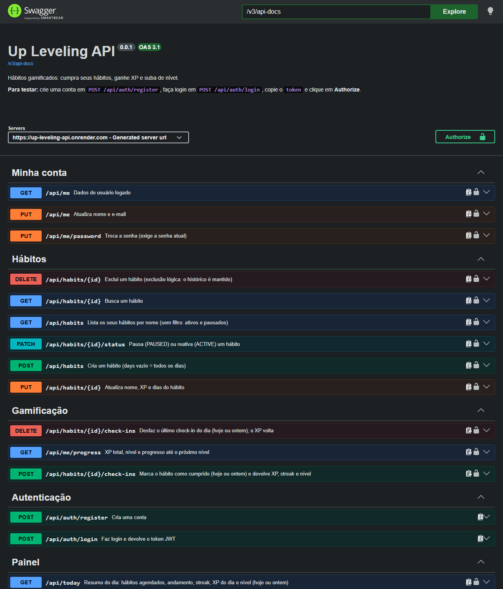
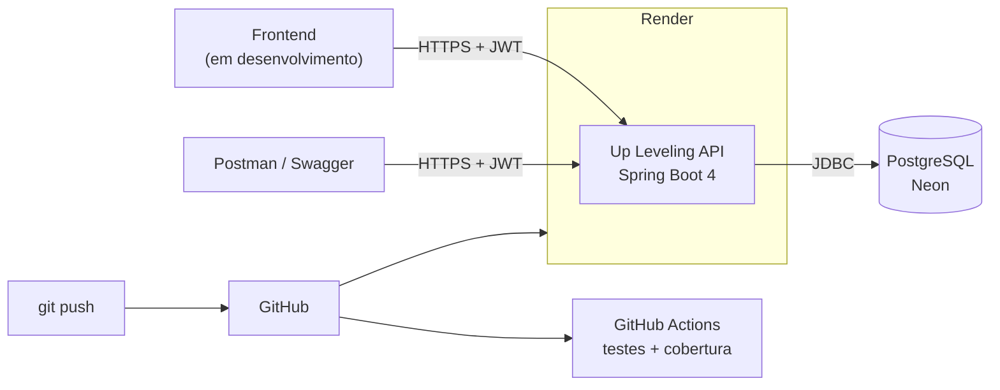
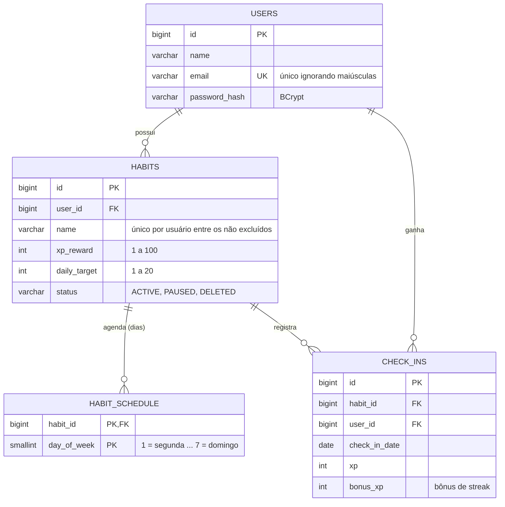

# 🎮 Up Leveling


**Hábitos gamificados:** cumpra seus hábitos, ganhe XP, mantenha sequências e suba de nível.

API REST em **Java 21 + Spring Boot 4**, pensada para um frontend completo (em desenvolvimento): cada tela do app é atendida por uma chamada só.



## 🌐 Demo online
- **Swagger:** https://up-leveling-api.onrender.com (a raiz abre a documentação)
- **Conta demo:** `demo@upleveling.local` / `demo1234`, com 5 hábitos e 30 dias de histórico (nível, sequências e gráfico preenchidos)

> ⏳ Hospedado no plano gratuito: depois de um tempo sem acesso, a primeira requisição pode levar cerca de 1 minuto para "acordar" a API.

## 🕹️ Regras do jogo
| Regra | Como funciona |
|---|---|
| **Check-in** | Marcar o hábito como cumprido rende o XP dele. Vale para **hoje ou ontem** (esqueceu de marcar) e só nos **dias da agenda** do hábito |
| **Meta diária** | Um hábito pode pedir vários check-ins por dia (ex.: "Beber água" 8 vezes); cada um rende XP, até a meta |
| **Níveis** | Para chegar ao nível *n* são precisos `50 × n × (n − 1)` de XP: nível 2 = 100, 3 = 300, 4 = 600, 5 = 1000... |
| **Streak** | Dias da agenda seguidos com a meta cumprida. Dias fora da agenda não quebram a sequência; o dia de hoje ainda em aberto também não |
| **Bônus** | A cada 7 dias seguidos, o check-in que fecha o dia rende **+50%** do XP do dia daquele hábito |
| **Desfazer** | Remove o último check-in do dia; o XP (bônus incluído) volta |

## 🛠️ Stack
- **Java 21** + **Spring Boot 4.1** (Spring Framework 7, Jackson 3, Hibernate 7)
- **Spring Security** + **JWT** (OAuth2 Resource Server / Nimbus) + **BCrypt**
- **Spring Data JPA** + **PostgreSQL 17** + **Flyway**
- **springdoc-openapi** (Swagger UI)
- **JUnit 5** + **Testcontainers** (Postgres real nos testes) + **JaCoCo**
- **Docker**, **GitHub Actions**, **Render** + **Neon**

## 🏗️ Arquitetura



## 🗂️ Modelo de dados


Não existe coluna de XP total nem de nível: os dois são **calculados** a partir dos check-ins, então nunca ficam desatualizados.

## 📡 Endpoints

| Método | Rota | Descrição |
|---|---|---|
| POST | `/api/auth/register` | Cria uma conta (público) |
| POST | `/api/auth/login` | Devolve o token JWT (público) |
| GET | `/api/me` | Dados do usuário logado |
| PUT | `/api/me` | Atualiza nome e e-mail |
| PUT | `/api/me/password` | Troca a senha (exige a atual) |
| GET | `/api/me/progress` | XP total, nível e progresso até o próximo |
| GET | `/api/me/xp-history?from=&to=` | XP por dia, para o gráfico (padrão: 30 dias) |
| GET | `/api/habits?status=` | Lista os hábitos (padrão: ativos e pausados) |
| POST | `/api/habits` | Cria um hábito (`days` vazio = todos os dias) |
| GET | `/api/habits/{id}` | Busca um hábito |
| PUT | `/api/habits/{id}` | Atualiza nome, XP, meta e dias |
| PATCH | `/api/habits/{id}/status` | Pausa (`PAUSED`) ou reativa (`ACTIVE`) |
| DELETE | `/api/habits/{id}` | Exclui (exclusão lógica: o histórico fica) |
| POST | `/api/habits/{id}/check-ins` | Check-in de hoje ou de ontem (`{"date": ...}`) |
| DELETE | `/api/habits/{id}/check-ins?date=` | Desfaz o último check-in do dia |
| GET | `/api/today?date=` | Resumo do dia: hábitos, andamento, streak, XP do dia e nível |
| GET | `/api/check-ins?habitId=&from=&to=&page=&size=` | Histórico paginado |

### Exemplo: check-in
```json
POST /api/habits/1/check-ins
{
  "habitId": 1, "date": "2026-10-07",
  "xpChange": 45, "bonusXp": 15,
  "dayCount": 1, "dailyTarget": 1, "dayCompleted": true,
  "streak": 7, "leveledUp": true,
  "progress": { "totalXp": 1015, "level": 5, "currentLevelXp": 1000, "nextLevelXp": 1500, "progressPercent": 3 }
}
```
O `leveledUp` existe para o frontend mostrar a animação de "subiu de nível!".

### Formato de erro
Todos os erros seguem o padrão [RFC 9457](https://www.rfc-editor.org/rfc/rfc9457) (Problem Details):
```json
{
  "type": "about:blank",
  "title": "Erro de validação",
  "status": 400,
  "detail": "Um ou mais campos são inválidos",
  "fields": { "xpReward": "deve estar entre 1 e 100" }
}
```

## 🚀 Como rodar
Pré-requisitos: Java 21 e Docker.

```bash
# 1. Sobe o Postgres (porta 5434)
docker compose up -d

# 2. Sobe a API
./mvnw spring-boot:run
```

Ou tudo em container, já com a conta demo:
```bash
docker compose --profile app up --build
```

- Swagger: http://localhost:8080 (a raiz abre a documentação)
- Health: http://localhost:8080/actuator/health

### Postman
A collection com todas as rotas está em [`postman/`](postman/up-leveling.postman_collection.json). Importe no Postman (ou no Insomnia) e rode as pastas em ordem: o **Cadastro** cria um usuário novo a cada execução e o **Login** guarda o token, usado automaticamente nas outras requests.

Para usar a **produção com a conta demo**, importe também o ambiente [`up-leveling-producao`](postman/up-leveling-producao.postman_environment.json) e selecione-o. Com ele ativo, o Login entra na conta demo, e o Cadastro, o Atualizar perfil e o Trocar senha são pulados. A última pasta exclui os hábitos que a collection criou, então ela pode rodar várias vezes seguidas.

### Testes
```bash
./mvnw verify
```
O Docker precisa estar rodando: o Testcontainers sobe um Postgres temporário para os testes. Relatório de cobertura: `target/site/jacoco/index.html`.

- **Integração** (API inteira + Postgres real): autenticação, hábitos, check-ins, painel, CORS e conta demo.
- **Unidade** (sem Spring, em milissegundos): a curva de níveis e o cálculo do streak.
- O "hoje" dos testes é controlado por um `Clock` falso, que permite simular uma semana de check-ins em milissegundos.

## ☁️ Deploy
- **[Render](https://render.com)** roda a API a partir do `Dockerfile`, com a configuração versionada em [`render.yaml`](render.yaml).
- **[Neon](https://neon.tech)** hospeda o PostgreSQL.
- Perfil **`prod`**: pool de conexões reduzido e health sem detalhes. Perfil **`demo`**: recria a conta demo **relativa à data de hoje** a cada inicialização, para o streak e o gráfico nunca envelhecerem.
- Variáveis: `DB_URL`, `DB_USER`, `DB_PASSWORD`, `JWT_SECRET`, `APP_TIME_ZONE` e `CORS_ALLOWED_ORIGINS` (endereços do frontend).

## 📁 Estrutura

O código é organizado **por funcionalidade**, não por camada:

```
src/main/java/io/github/rodrigodsantos/upleveling
├── auth/           # cadastro, login e geração do token JWT
├── user/           # entidade User, /api/me e troca de senha
├── habit/          # hábitos, agenda semanal (DayOfWeek ↔ 1-7) e status
├── gamification/   # check-ins, XP, níveis (Levels) e streak (StreakCalculator)
├── dashboard/      # leituras para as telas: resumo do dia, histórico e gráfico
├── demo/           # conta demo recriada a cada inicialização (perfil demo)
├── config/         # segurança, CORS, Clock, OpenAPI e páginas em JSON estável
└── shared/         # exceções + handler RFC 9457, CurrentUser, utilitários
```

## 🧠 Decisões técnicas
- **XP calculado, não armazenado:** o XP total é a soma dos check-ins. Desfazer um check-in é apagar a linha, e não existe saldo que possa ficar errado.
- **`Clock` injetado:** o "hoje" vem de um relógio no fuso `America/Sao_Paulo`, e não do relógio do servidor (em UTC, o dia viraria às 21h de Brasília). Nos testes, o mesmo ponto permite simular dias.
- **Regras puras isoladas:** níveis e streak são funções `static` sem banco nem relógio, testadas em unidade.
- **Sem N+1:** o resumo do dia calcula o streak de todos os hábitos a partir de **uma** consulta agrupada; os dias da agenda vêm com `@EntityGraph`.
- **Consultas que já devolvem DTOs:** o histórico usa `SELECT new ...` com JOIN, sem carregar entidades.
- **"/api/me" em vez de "/users/{id}":** o id vem do token, então ninguém consegue pedir os dados de outra pessoa. Recurso de outro usuário responde **404**, sem revelar que existe.
- **Exclusão lógica:** um hábito excluído some das telas, mas o histórico e o XP continuam.
- **Nome de hábito único por usuário:** índice **parcial** no Postgres (`WHERE status <> 'DELETED'`), então um nome excluído fica livre de novo.
- **Migrations nunca são editadas:** cada mudança de schema é um arquivo novo do Flyway; `ddl-auto: validate` só confere se as entidades batem.
- **Entidades sem setters e sem Lombok:** as mudanças passam por métodos com nome (`updateProfile`, `changePassword`, `update`).
- **Senha de 8 a 72 caracteres:** o BCrypt ignora o que passa de 72 bytes.
- **Conta demo protegida:** visitantes não conseguem trocar o e-mail nem a senha dela (o que trancaria a demo para os outros).
- **Páginas em JSON estável** (`content` + `page`), para o frontend não depender da classe interna do Spring.

## 🗺️ Roadmap
- [x] Fundação: Java 21, Spring Boot 4, Flyway, Swagger, erros RFC 9457, Testcontainers, CI
- [x] Usuários e autenticação JWT
- [x] Hábitos com agenda semanal
- [x] Gamificação: check-ins com meta diária, XP, níveis, streak com bônus e desfazer
- [x] Endpoints para o frontend: resumo do dia, histórico e XP por dia
- [x] Docker, conta demo e configuração de deploy
- [x] Deploy publicado (Render + Neon)
- [ ] Frontend

### Melhorias futuras
- Fuso horário por usuário (hoje, todos seguem `America/Sao_Paulo`)
- Refresh token e logout
- Conquistas (badges) por marcos: primeiro check-in, 30 dias seguidos, nível 10...
- Lembretes por e-mail ou notificação
